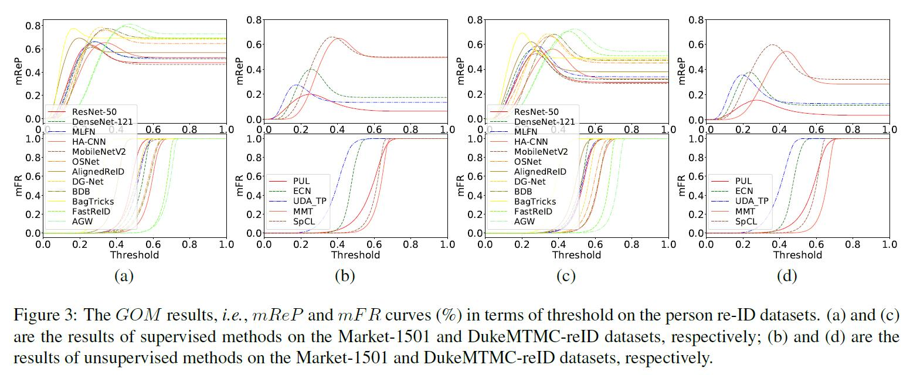
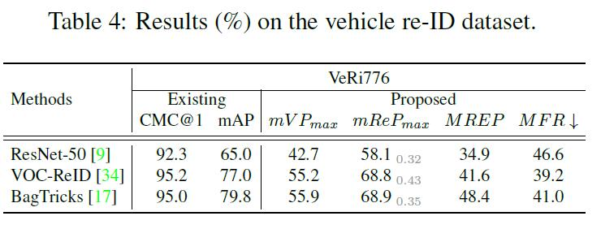

# Genuine Openset re-ID Metric (GOM)
The *official* repository for [Re-identification = Retrieval + Verification: Back to Essence and Forward with a New Metric](https://arxiv.org/abs/2011.11506). GOM evaluates the state-of-the-art methods on both **supervised learning** tasks and **unsupervised learning** tasks for object re-ID, including person re-ID and vehicle re-ID.


**Illustration of existing retrieval and verification procedures.** 1) Closed-world retrieval: the method returns a ranking list to users and cannot tell which images are the true targets. The user needs to judge targets according to their experience and feeling. 2) Closed-world verification: given a decision boundary, images whose distances are below the boundary are considered as the targets. Nevertheless, the method cannot distinguish ground truth (GT) and non-GT within the boundary. 3) Open-set: the GT of the probe does not always exist in the gallery, thus re-ID procedure should include this kind of scenario.

## Comparison with existing metrics


## A family of metrics of GOM
<br/>

## Prerequisites
- Python3.0+
- Scipy=1.1.0
- Numpy=1.15.1

## Getting started
Check the Prerequisites. Then download GOM.py and test.py. Next put them in the same directory as you want.

## Part 1: Prepare data
Extract distance, gallery_label, gallery_cam, query_label, and query_cam for the different methods of ReID.

Save the data format as follows:
```
mat:{'distmat':distmat,'gallery_label':gallery_label,'gallery_cam':gallery_cam,'query_label':query_label,'query_cam':query_cam} # Save to Mat for testing
```

## Part 2: Testing
In test.py, you need to do the following simple operation:
```
# Market1501 and DukeMTMC-reID
# Supervised methods
method_name = ['ResNet-50', 'DenseNet-121', 'MLFN', 'HA-CNN', 'MobileNetV2', 'OSNet', 'AlignedReID', 'DG-Net', 'BDB', 'BagTricks', 'FastReID', 'AGW']
line_type = ['-', '--', '-.', '-', '--', '-.', '-', '--', '-.' ,'-', '--', '-.' ]
line_color = ['red', 'green', 'blue', 'tomato', 'sienna', 'darkorange', 'darkgoldenrod', 'gold', 'olive', 'yellow', 'lawngreen', 'palegreen']
line_width = [2, 2, 2, 2, 2, 2, 2, 2, 2, 2, 2, 2]

# Unsupervised methods
method_name = ['PUL', 'ECN', 'UDA_TP', 'MMT', 'SpCL']
line_type = ['-', '--', '-.', '-', '--']
line_color = ['red', 'green', 'blue', 'tomato', 'sienna']
line_width = [2, 2, 2, 2, 2]

# ViRi776
method_name = ['ResNet-50', 'VOC-ReID', 'BagTricks']
line_type = ['-', '--', '-.']
line_color = ['red', 'green', 'blue']
line_width = [2, 2, 2]
```
According to the format and name of ReID method in part 1. You need to modify the parameters of method_name, line_type and line_width.

Next, you can run the shell:
```
python test.py
```

Finally, you can get rank-1, mAP, mVP, mReP, MREP, MFR and the curve of mReP and mFR.

## Comparison with existing metrics using toy samples


**A simple re-ID example highlighting the main differences between evaluation metrics.** Six different ranking lists are shown. *AP* and *FAR* overemphasize the task of retrieval and verification respectively. *GOM* balances both of these by being an explicit combination of a retrieval precision *RP* and a verification precision *VP*, contributed to re-ID precision *ReP*, and assess the false rate under the different threshold by *FR*.

## Experiment results





## Citation
If you find this code useful for your research, please cite our paper
```
@article{wang2020gom,
  title={Re-identification = Retrieval + Verification: Back to Essence and Forward with a New Metric},
  author={Wang, Zheng and Yuan, Xin and Yamasaki, Toshihiko and Lin, Yutian and Xu, Xin and Zeng, Wenjun},
  journal={arXiv preprint arXiv:2011.11506},
  year={2020}
}
```

